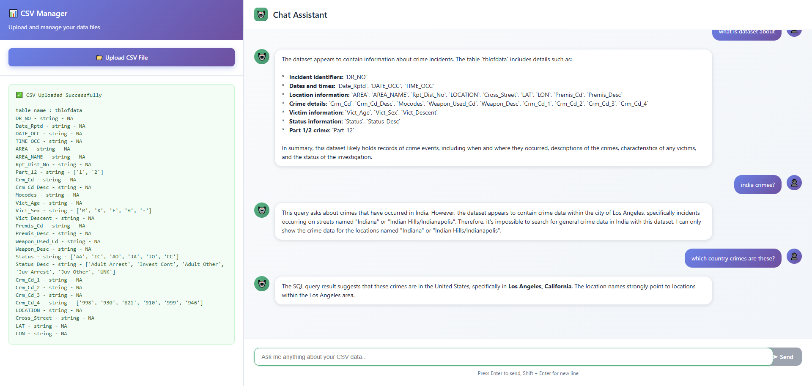

# 🚀 CSV-to-SQL AI Query Engine v2

A full-stack application that converts any CSV into an SQLite database and allows you to query it in plain English using **Google Gemini** LLM API. Built with:

- **FastAPI** backend for CSV upload and AI-powered SQL query execution.
- **React + Vite** frontend with a chat interface and CSV uploader.



## 💡 Features

- 📂 Upload CSV files and auto-generate SQLite schemas.
- 🔄 Analyze data structure with "thingmaker" metadata generator.
- 🤖 Query your data using natural language.
- 🔭 Google Gemini (`gemini-1.5-flash`) generates SQL and explains results.
- 🔄 Differentiates between database queries and normal chat.

---

## 🏗️ Architecture

```
React + Vite
  ↓  (HTTP, JSON)
FastAPI (Python)
  ├── Upload CSV  → pandas DataFrame → SQLite database
  └── Natural Language Question → Gemini API → SQL → Query SQLite → Gemini Explanation → Response
```

---

## 🔧 Setup

### Backend (FastAPI)

```bash
# Install dependencies
pip install fastapi uvicorn pandas sqlite3 python-dotenv google-generativeai

# Set Gemini API key
export GOOGLE_API_KEY=your_api_key_here

# Run server
uvicorn main:app --reload
```

### Frontend (React + Vite)

```bash
# Create React + Vite project
npm create vite@latest frontend -- --template react
cd frontend

# Install dependencies
npm install

# Start dev server
npm run dev
```

### Optional UI Enhancements
- Tailwind CSS
- Shadcn UI


---

## 🌐 Deployment Ready

- CORS configured for `http://localhost:5173`
- SQLite local DB (`dbdb.db`)
- Designed for easy deployment on Render, Railway, Fly.io, etc.

---

## 📊 Roadmap

- [x] CSV upload and schema inference
- [x] AI-powered SQL query generation
- [x] Natural vs Database query classification
- [ ] User authentication & sessions
- [ ] Multi-dataset support

---

## 📢 Contribute

PRs and forks welcome!

```bash
git clone https://github.com/yourusername/csv-to-sql-ai
```

---

MIT License
